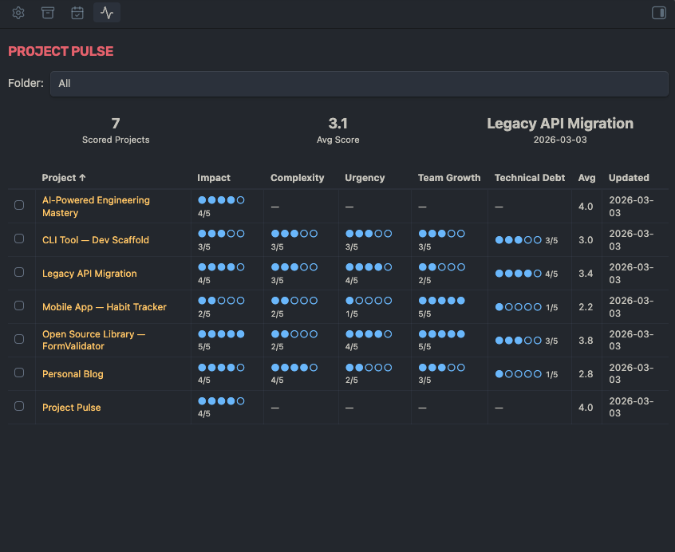
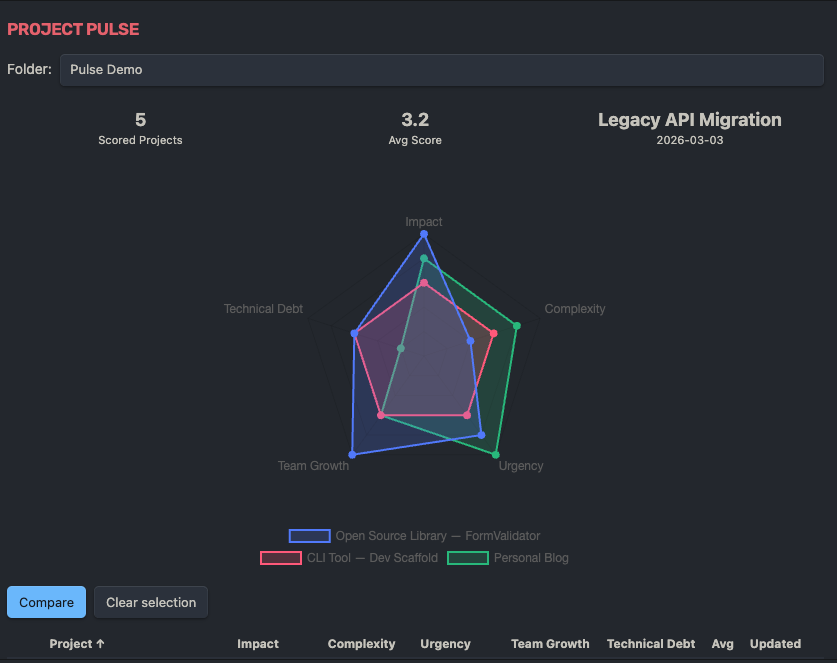
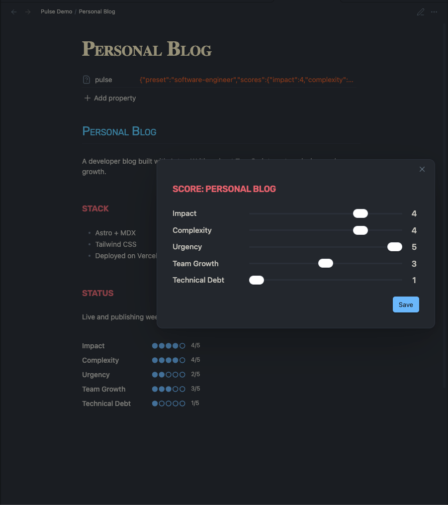

# Project Pulse

Score your projects across custom dimensions (1–5) and visualize trade-offs — right inside Obsidian.

Inspired by *The Staff Engineer's Path* by Tanya Reilly, but generalized for anyone who juggles multiple projects.








## Features

- **Scoring modal** — `Cmd/Ctrl+P` → "Score this project" → rate each dimension with sliders (1–5). Scores save to YAML frontmatter.
- **Dashboard sidebar** — Sortable table of all scored projects with dot scores (`●●●●○ 4/5`), summary cards, and folder filtering.
- **Radar chart comparison** — Select 2–3 projects in the dashboard to overlay their scores on a radar chart.
- **In-note scorecard** — Add a `` ```pulse `` code block to any scored note to display its scores inline.
- **6 built-in presets** — Default, Software Engineer, Freelancer, Student, Creator, Manager — or define fully custom dimensions.
- **Frontmatter-based** — All data lives in your notes as standard YAML. No external database, no lock-in.

## Installation

### Manual

1. Download `main.js`, `manifest.json`, and `styles.css` from the [latest release](https://github.com/muhammadFawzy/obsidian-project-pulse/releases).
2. Create a folder `project-pulse` inside your vault's `.obsidian/plugins/` directory.
3. Copy the three files into that folder.
4. Open Obsidian → Settings → Community plugins → Enable "Project Pulse".

## Usage

### Score a project

1. Open any markdown note.
2. `Cmd/Ctrl+P` → **"Project Pulse: Score this project"**.
3. Adjust the sliders for each dimension, then click **Save**.

Your scores are stored in the note's frontmatter:

```yaml
pulse:
  preset: default
  scores:
    energy: 4
    impact: 5
    learning: 2
    enjoyment: 3
    growth: 4
  last_updated: 2026-03-03
```

### Dashboard

Open via `Cmd/Ctrl+P` → **"Project Pulse: Open dashboard"** or click the activity icon in the ribbon.

- Sort by any column (click headers)
- Filter by folder
- Check 2–3 projects to compare them on a radar chart

### In-note scorecard

Add this code block to any scored note:

````
```pulse
```
````

It renders a vertical scorecard with dot indicators for each dimension.

## Configuration

Go to **Settings → Project Pulse**:

- **Preset** — Choose from Default, Software Engineer, Freelancer, Student, Creator, Manager, or Custom.
- **Custom dimensions** — Define your own dimensions when "Custom" is selected.
- **Target folders** — Limit the dashboard to specific folders (comma-separated). Leave empty to scan all.

## License

[MIT](LICENSE)
